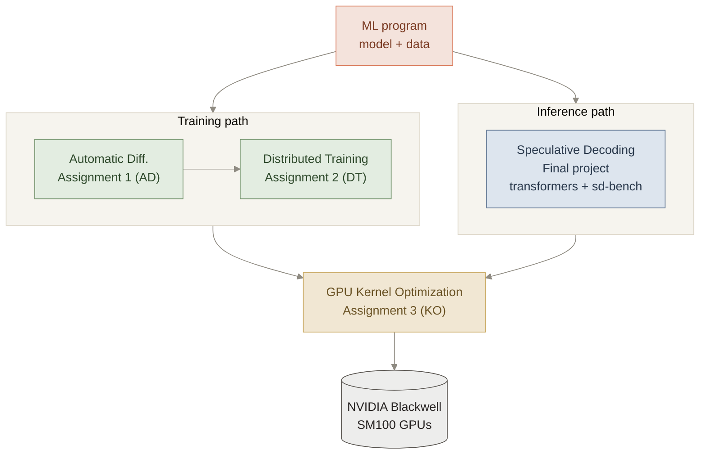
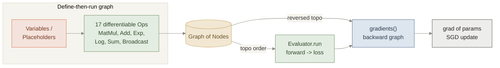
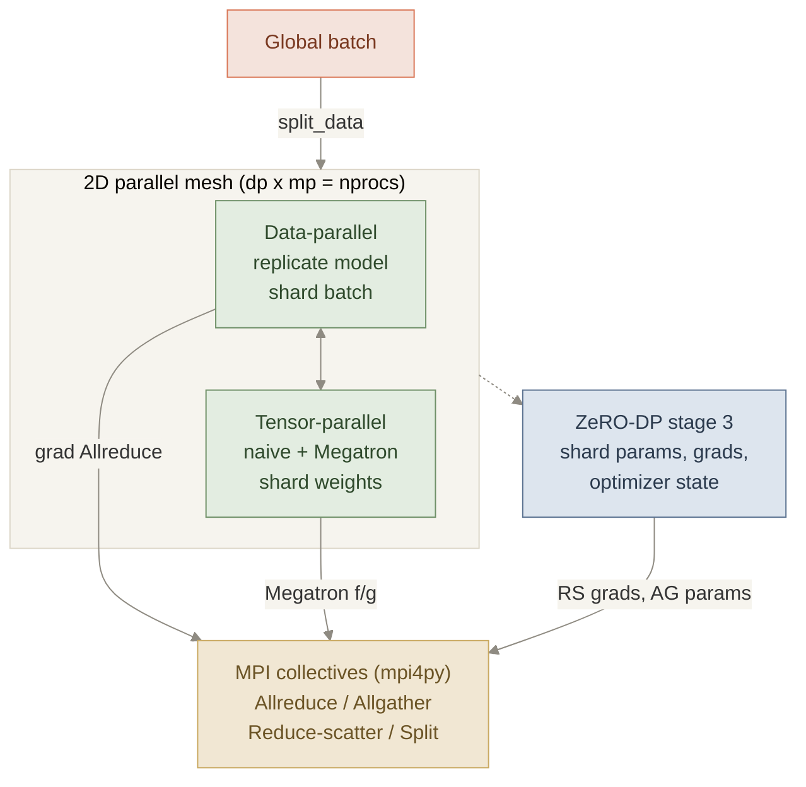
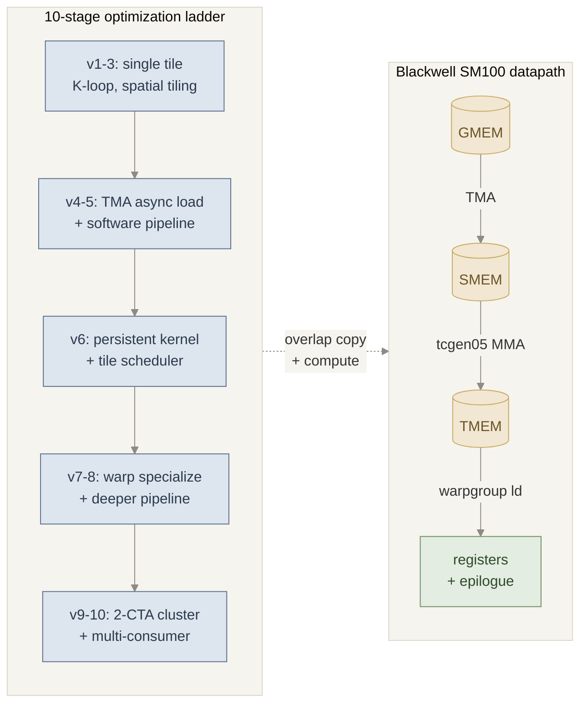
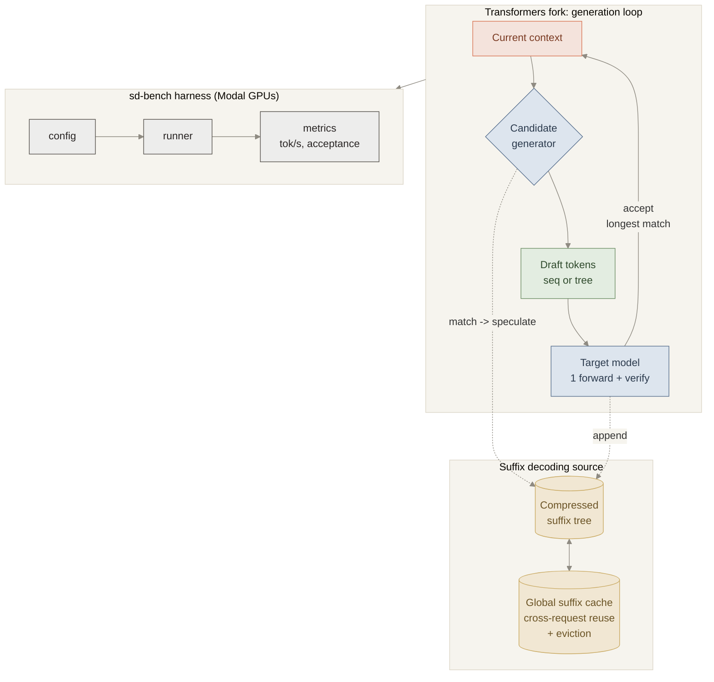

# CMU-15642-26Spring
# Machine Learning Systems
[Prof. Tianqi Chen](https://tqchen.com/) | Assistant Professor of Computer Science at CMU · co-creator of TVM, XGBoost, MXNet

[Prof. Zhihao Jia](https://www.cs.cmu.edu/~zhihaoj2/) | Assistant Professor of Computer Science at CMU

[Course Official Website](https://mlsyscourse.org/) | [CMU SCS Description](https://www.csd.cs.cmu.edu/course/15642/s26)

This course builds a modern machine-learning system from the ground up — from the automatic-differentiation engine that powers training, through distributed-training runtimes and GPU kernels, to an inference/serving stack. The four projects below map onto that full stack:

## Assignment 1: Automatic Differentiation
Assignment 1 focuses on building a **reverse-mode automatic differentiation engine from scratch** — the computational-graph core that powers frameworks like PyTorch and TensorFlow — on top of NumPy, and then using it to train a real classifier end-to-end.
- **Key Words:** Automatic differentiation, reverse-mode autodiff, computational graph, backpropagation, topological sort, vector-Jacobian product, define-then-run, broadcasting, NumPy, logistic regression, etc.

### System Architecture

*A model is expressed as a graph of `Node`s built from differentiable `Op`s. Forward values are computed by traversing the graph in topological order; gradients are produced by walking it in **reversed** topological order and accumulating vector-Jacobian products — differentiation is itself graph construction.*

> **Infra highlights:** implemented a PyTorch-style reverse-mode autodiff engine from scratch — a `Node` / `Op` computational-graph abstraction, 17 differentiable operators (each with forward `compute` and backward `gradient`/VJP), a topological-order evaluator, and a reverse-mode `gradients()` pass — then trained a classifier end-to-end using only the engine's own gradients.

### Computational Graph & Operators
Every value is a `Node` produced by an `Op`. Each `Op` implements two methods: `compute` (the forward numerical result) and `gradient` (the backward vector-Jacobian product that emits new graph nodes). The 17 operators include `MatMul` (with transpose flags), element-wise `Add`/`Mul`/`Div` and their by-constant variants, `Exp`, `Log`, `Sum`, `BroadcastTo`, `ReduceSumToLike`, and `ExpandDims` — enough to express and differentiate a full linear/softmax model, including broadcasting semantics.

### Forward Evaluation & Reverse-Mode Gradients
The `Evaluator` computes outputs by topologically sorting the graph reachable from the eval nodes and evaluating each node once. `gradients()` then constructs the **backward graph**: it seeds the output adjoint, walks nodes in reversed topological order, and routes each node's output-gradient through its `Op.gradient` to accumulate input gradients. Because gradients are themselves graph nodes, the design is compositional and higher-order-ready.

### Applied Model
The engine is used to build and train a logistic-regression / softmax classifier (`logistic_regression.py`) on the digits dataset — constructing the loss graph, calling `gradients()` for `∂loss/∂W` and `∂loss/∂b`, and running SGD — validating the autodiff engine against a real training loop.

## Assignment 2: Distributed Training
Assignment 2 focuses on implementing the **communication layer of a 2D-parallel training pipeline** — combining *data parallelism* and *tensor model parallelism* (both naive and Megatron-style) — and extending it with **ZeRO-style optimizer-state sharding**, all built from scratch on raw MPI collectives.
- **Key Words:** Distributed training, data parallelism, tensor model parallelism, Megatron-LM, ZeRO / DeepSpeed, 2D parallelism, MPI, mpi4py, all-reduce, all-gather, reduce-scatter, collective communication, gradient synchronization, memory profiling, etc.

### System Architecture

*`nprocs` workers are arranged into a `dp_size × mp_size` mesh via `MPI.Split`. Data-parallel groups shard the batch and all-reduce gradients; tensor-parallel groups shard weight matrices and exchange activations/partial sums; ZeRO-3 further shards parameters, gradients, and optimizer state across data-parallel ranks — all expressed with four MPI collectives implemented by hand.*

> **Infra highlights:** built the exact communication patterns behind Megatron-LM and DeepSpeed from scratch on MPI — data-parallel gradient all-reduce, naive vs. Megatron-style tensor-parallel operators, and ZeRO-DP stage-3 parameter/gradient/optimizer-state sharding — with a memory profiler quantifying the per-device memory savings.

### 2D Parallel Mesh
The world of `nprocs` processes is factored as `dp_size × mp_size = nprocs`. `MPI.Split` carves it into orthogonal data-parallel and model-parallel sub-communicators so each collective runs on exactly the right group. The unified trainer (`unified_train.py`) drives both dimensions from a single configuration.

### Data & Tensor Model Parallelism
**Data parallelism** replicates the model, shards the global batch with `split_data`, and synchronizes gradients with an all-reduce before each optimizer step. **Tensor model parallelism** shards the weight matrices across ranks; the assignment implements both a *naive* scheme (all-gather activations) and the *Megatron-style* `f`/`g` conjugate operators (all-reduce in the forward and backward passes) that keep communication on the critical path minimal.

### ZeRO-DP Stage 3 & Memory Profiling
`zero_dp_train.py` / `zero_dp_stage3.py` implement ZeRO stage-3, sharding **parameters, gradients, and Adam optimizer state** across data-parallel ranks. Gradients are combined with reduce-scatter and parameters are re-materialized on demand with all-gather, cutting per-device memory to roughly `1/dp_size`. A `memory_profiler` measures the footprint to make the savings concrete.

### Collectives From Scratch
Only `Allreduce`, `Allgather`, `Reduce_scatter`, and `Split` are permitted — all wrapped in `mpi_wrapper/comm.py` over `mpi4py` + NumPy. Every higher-level parallel strategy above is expressed purely in terms of these four primitives.

## Assignment 3: Blackwell GEMM Kernel Optimization
Assignment 3 focuses on building a **high-performance FP16 GEMM kernel for NVIDIA Blackwell (SM100) GPUs** using TVM/TIRX — starting from a minimal single-tile kernel and incrementally adding optimizations across **10 stages** until it matches the structure of production-grade (cuBLAS/CUTLASS-style) implementations.
- **Key Words:** GPU kernels, GEMM, NVIDIA Blackwell SM100, TVM/TIRX, Tensor Cores (tcgen05), TMA, Tensor Memory (TMEM), mbarriers, warp specialization, software pipelining, CTA clusters, FP16, CUDA, high-performance computing, etc.

### System Architecture

*TMA asynchronously streams tiles GMEM→SMEM; the `tcgen05` tensor-core MMA reads SMEM and writes results into TMEM (a Tensor-Core-private scratchpad); a warpgroup then loads TMEM→registers for the epilogue. `mbarrier` phase synchronization lets memory movement and tensor-core compute overlap — the mechanism every optimization stage exploits more aggressively.*

> **Infra highlights:** hand-wrote a production-structured FP16 GEMM for NVIDIA's newest (Blackwell SM100) architecture across 10 optimization stages — TMA async copies, `tcgen05` tensor-core MMA into Tensor Memory, mbarrier phase synchronization, software pipelining, producer/consumer warp specialization, deep pipelines, and multi-CTA clusters — the same techniques that live inside cuBLAS and CUTLASS.

### Blackwell Async Datapath
The kernel is organized around Blackwell's asynchronous hardware units. **TMA** (Tensor Memory Accelerator) copies rectangular, swizzled tiles between global and shared memory with no thread involvement. **`tcgen05`** issues asynchronous tensor-core MMAs that read A/B from shared memory and accumulate directly into **TMEM**, a high-bandwidth scratchpad private to the Tensor Cores. **mbarriers** — hardware counters with a phase bit — let producers (TMA) and consumers (MMA) synchronize and reuse buffers across loop iterations, which is the key to overlapping copy with compute.

### The 10-Stage Optimization Ladder
1. **Single-tile synchronous GEMM** — one 128×128 tile, no loops.
2. **K-loop** — accumulate partial products in TMEM.
3. **Spatial tiling** — multi-CTA over the full output.
4. **TMA async load** — hardware-driven tile prefetch.
5. **Software pipeline** — overlap load of tile *k+1* with compute of tile *k*.
6. **Persistent kernel + tile scheduler** — CTAs stay resident and stream tiles.
7. **Warp specialization** (`PIPE_DEPTH=2`) — dedicated producer/consumer warps.
8. **Deeper pipeline** (`PIPE_DEPTH=4`) — more in-flight buffers hide latency.
9. **2-CTA cluster** — cooperating CTAs share operands via the cluster address space.
10. **2-consumer warp specialization** — parallel consumers drain the pipeline.

Each step brings the kernel closer to peak Tensor-Core utilization while keeping numerical results correct.

## Final Project: Speculative Decoding for LLM Serving
The final project focuses on accelerating **LLM inference** by extending HuggingFace Transformers with two new **speculative decoding** strategies — *suffix decoding* and *tree-based speculation* — and building a reproducible GPU benchmark harness ([`sd-bench`](https://github.com/stormckey/sd-bench)) to measure their throughput against strong baselines.
- **Key Words:** LLM inference, speculative decoding, suffix decoding, tree speculation, prompt lookup, draft models, candidate generation, KV cache, throughput optimization, Modal, Qwen3-8B, HuggingFace Transformers, LLM serving, etc.

### System Architecture

*A candidate generator proposes several draft tokens (a linear sequence or a full tree); the target model verifies them all in **one** forward pass and accepts the longest matching prefix, amortizing the memory-bound cost of autoregressive decoding. Our new **suffix-decoding** source mines a path-compressed suffix tree — backed by a global cross-request cache — for those candidates.*

> **Infra highlights:** extended a large production codebase (HuggingFace Transformers) with two speculative-decoding generators — a path-compressed **suffix tree** with a **global cross-request cache + eviction** and an incremental verifier, plus a **tree** speculation variant — and built a reproducible Modal-GPU benchmark that showed **2.1–2.5× decoding throughput** over vanilla autoregressive on Qwen3-8B.

### Speculative Decoding Loop
Decoding is normally one token per model call and is bottlenecked by memory bandwidth, not compute. Speculative decoding breaks that limit: a lightweight `CandidateGenerator` proposes `k` draft tokens, the full model verifies them in a single batched forward pass, and every token up to the first mismatch is accepted for free. The implementation slots into Transformers' existing candidate-generator interface alongside draft-model and prompt-lookup baselines.

### Suffix Decoding (new)
`SuffixDecodingCandidateGenerator` speculates from a **compressed suffix tree** (`suffix_tree.py`) that indexes previously seen token spans with path compression. Matching the current context against the tree yields high-probability continuations at near-zero cost. A **`SuffixDecodingCache`** shares suffix trees *across requests* (with size caps and oldest-first eviction), and a per-request tree pool keeps memory reclamation clean — enabling both *local* (within-request) and *global* (cross-request) matching modes.

### Tree Speculation (new)
`TreeSpecDecodingCandidateGenerator` extends suffix decoding to speculate a **tree** of candidate continuations rather than a single linear draft, so several likely branches are verified together in one pass — raising the expected number of accepted tokens per step.

### Benchmark Harness & Results
[`sd-bench`](https://github.com/stormckey/sd-bench) is a reproducible harness (`config → runner → methods → datasets → metrics`) that runs on **Modal GPUs** and compares five methods — autoregressive, draft-model, prompt-lookup, suffix, and tree speculation — across WMT14, WildChat, Spider, SWE-bench, and TerminalBench, emitting `raw.jsonl` + `summary.json` per run.

On the default WMT14 French→English suite (Qwen3-8B, L40S, 50 prompts):

| Method | Throughput | vs. vanilla |
| --- | --- | --- |
| **suffix_speculative** | **55.0 tok/s** | **2.14×** |
| prompt_lookup | 45.0 tok/s | 1.75× |
| autoregressive | 25.7 tok/s | 1.00× |
| draft_speculative | 17.3 tok/s | 0.67× |

Suffix decoding was the clear winner across suites (up to ~2.49× vanilla on WildChat), while keeping peak GPU memory essentially flat — demonstrating that the right speculation source, not a bigger draft model, is what unlocks serving throughput.

# Repository Layout
Each assignment and the final project live in their own private repositories, linked here as submodules (mirroring the structure of my [15-641](https://github.com/ErwinZhou/CMU-15641-25Fall) and [15-640](https://github.com/ErwinZhou/CMU-15640-25Fall) repos):

| Submodule | Project |
| --- | --- |
| `ad` | Assignment 1 — Automatic Differentiation |
| `dt` | Assignment 2 — Distributed Training |
| `ko` | Assignment 3 — Blackwell GEMM Kernel Optimization |
| `transformers` | Final project — Transformers fork with suffix / tree speculative decoding |
| `sd-bench` | Final project — LLM serving benchmark harness |

# Disclaimer
This repository only contains descriptions of the projects I worked on during this class. As per the [Academic Integrity (AI) Policy of CMU](https://www.cmu.edu/policies/student-and-student-life/academic-integrity.html), all solutions and code are stored separately in private repositories.

If you are a hiring manager evaluating my skills, or if you are simply interested in contributing to its further development, please contact me via email.
